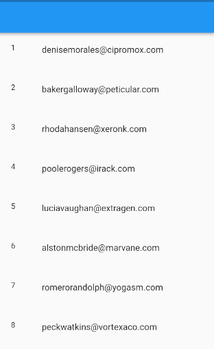
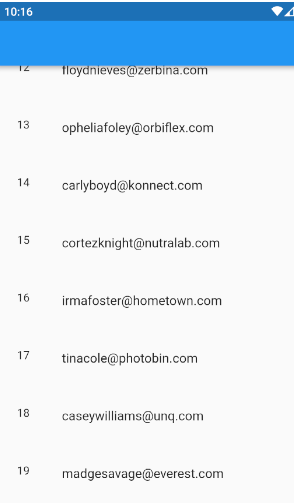

# Flutter Pagination App

Bu uygulama bir web service üzerinden gelen kullanıcıları 
sayfalama yaparak listeleyen bir flutter projesidir

### Screenshots





Uygulamada kullanılan paketler

- [dio] - Kendi oluşturduğum bir web serviceten veri çekmek için
- [freezed] - Freezed package ile data class yapısı oluşturuldu. Böylece oluşturulan yapı sadece veri taşımak için kullanıldı
- [json annotation] - Json olarak verilerle çalışırken servisten gelen verideki alan adları ile projemizdeki alan adları farklı olsa bile bu veriler birbiri ile ilişkilendirilebilir.

Olmazsa olmaz eklentimiz
```sh
build runner
```


 Bu projede kullanılan backend uygulaması profilimdeki
 NodeJS_Custom_Server adlı uygulamadır.